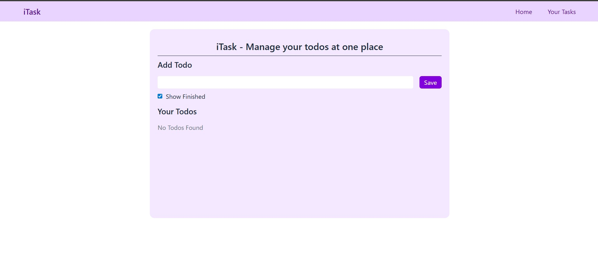

# 📝 React + Tailwind Todo App

A simple and responsive Todo List application built using **React**, **Tailwind CSS**, and **localStorage** for data persistence. It helps users manage their daily tasks efficiently with a clean and modern UI.

## 📂 Project Structure

```
TODO/
├── node_modules/
├── public/
├── src/
│   ├── assets/
│   │   └── react.svg
│   ├── Components/
│   │   └── Navbar.jsx
│   ├── App.css
│   ├── App.jsx
│   ├── index.css
│   ├── main.jsx
├── .gitignore
├── eslint.config.js
├── index.html
├── package-lock.json
├── package.json
├── README.md
└── vite.config.js
```

## 🚀 Features

- ✅ Add, delete, and mark tasks as completed
- 💾 Saves todos in `localStorage` to persist data on reload
- 🎨 Styled with Tailwind CSS for a modern UI
- ⚛️ Built with React functional components and hooks
- 🌐 Fully responsive design
- 🧱 Clean folder structure

## 🛠 Tech Stack

- **React** (with hooks)
- **Tailwind CSS**
- **Vite** for blazing-fast development
- **localStorage** API

## 🧑‍💻 Getting Started

### Prerequisites

- Node.js installed
- npm or yarn

### Installation

```bash
# Clone the repository
git clone  https://github.com/sanyaaaa14/Todo-App  
cd todo-app

# Install dependencies
npm install

# Start development server
npm run dev
```

## ✨ Usage

- Type your task in the input field and press Enter or click **Add**.
- Click on a task to mark it as **completed**.
- Click the **delete (🗑️)** to remove a task.
- Your todos will be saved automatically in the browser's **localStorage**.

## 🖼️ Screenshots


```md

```

## 📦 Deployment

You can deploy this project on:

- [Netlify](https://netlify.com/)
- [Vercel](https://vercel.com/)
- [GitHub Pages](https://pages.github.com/)

Use the production build command before deployment:

```bash
npm run build
```

## 🤝 Contributing

Contributions, issues, and feature suggestions are welcome!  
Feel free to fork this repo and open a PR.

## 📄 License

This project is licensed under the MIT License.

---

Made with 💙 using React and Tailwind CSS.
